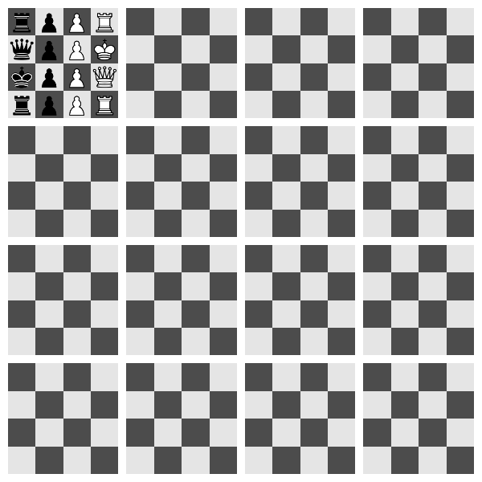

# n-dimensional chess



This is a work-in-progress implementation of a n-dimensional Chess framework.

# Rules

### Bishop

For an `n-d game`, the Bishop could move to the vertices of an integer `i-cube` (`2 <= i <= n`) in `n-d space` centered in the current position of the Bishop. This is equivalent to say the Bishop can move through its diagonals.

For example, in a `3-d game`, the Bishop could move according to `(k * _ for _ in BishopOffsets[i])`, with `k` being an integer from 1 to `board.size - 1`.

```python
BishopOffsets = [
    # 2-cube vertices in 3-d space
    (1, 1, 0),
    (1, -1, 0),
    (-1, 1, 0),
    (-1, -1, 0),

    # 3-cube vertices in 3-d space
    (1, 1, 1),
    (1, 1, -1),
    (1, -1, 1),
    (1, -1, -1),
    (-1, 1, 1),
    (-1, 1, -1),
    (-1, -1, 1),
    (-1, -1, -1)
]
```

## King

For an `n-d game`, the King could move to the vertices of an unit `i-cube` (`2 <= i <= n`) in `n-d space` centered in the current position of the King, and it nearest cardinal positions. This is equivalent to say the King can move 1 spot through every direction.

For example, in a `3-d game`, the King can move according to `KingOffsets[i]`.

```python
KingOffsets = [
    # 2-cube vertices in 3-d space
    (1, 1, 0),
    (1, -1, 0),
    (-1, 1, 0),
    (-1, -1, 0),

    # 3-cube vertices in 3-d space
    (1, 1, 1),
    (1, 1, -1),
    (1, -1, 1),
    (1, -1, -1),
    (-1, 1, 1),
    (-1, 1, -1),
    (-1, -1, 1),
    (-1, -1, -1),

    # cardinals in 3-d space
    (1, 0, 0),
    (-1, 0, 0),
    (0, 1, 0),
    (0, -1, 0),
    (0, 0, 1),
    (0, 0, -1)
]
```

### Knight

For an `n-d game`, the Knight could move 2 spots in a direction and 1 spot in a different direction.

For example, in a `3-d game`, the Knight could move according to `KnightOffsets[i]`.

```python
from itertools import product

KnightOffsets = []
for i in range(3): # 3-d space
    for j in range(3): # 3-d space
        if i == j: continue
        for p, q in product((-1, 1), repeat=2):
            offset = [0] * 3 # 3-d space
            offset[i] = 2 * p
            offset[j] = 1 * q
            KnightOffsets.append(tuple(offset))
```

### Pawn

For an `n-d game`, the Pawn could move forward 1 spot in the dimensions greater than 1. To capture, the Pawn can move one spot in the first dimension (any direction) and forward 1 spot in dimensions greater than 1.

For example, in a `3-d game`, the Pawn could move according to `PawnOffsets[i]`, or `PawnCaptureOffsets[i]` if available.

```python
PawnOffsets = [
    # "Forward 1 spot in the dimensions grater than 1" (unit vectors for dimensions grater than 1)
    # (1, 0, 0),
    (0, 1, 0),
    (0, 0, 1)
]

PawnCaptureOffsets = [
    # "One spot in the first dimension (any direction) and forward 1 spot in the dimensions greater than 1"
    (1, 1, 0),
    (-1, 1, 0),
    (1, 0, 1),
    (-1, 0, 1)
]
```

### Queen

For an `n-d game`, the Queen could move to the vertices of an integer `i-cube` (`2 <= i <= n`) in `n-d space` centered in the current position of the Queen, and to an integer scaled cardinal position. This is equivalent to say the Queen can move through every direction.

For example, in a `3-d game`, the Queen could move according to `(k * _ for _ in QueenOffsets[i])`, with `k` being an integer from 1 to `board.size - 1`.


```python
QueenOffsets = [
    # 2-cube vertices in 3-d space
    (1, 1, 0),
    (1, -1, 0),
    (-1, 1, 0),
    (-1, -1, 0),

    # 3-cube vertices in 3-d space
    (1, 1, 1),
    (1, 1, -1),
    (1, -1, 1),
    (1, -1, -1),
    (-1, 1, 1),
    (-1, 1, -1),
    (-1, -1, 1),
    (-1, -1, -1),

    # cardinals in 3-d space
    (1, 0, 0),
    (-1, 0, 0),
    (0, 1, 0),
    (0, -1, 0),
    (0, 0, 1),
    (0, 0, -1)
]
```

### Rook

For an `n-d game`, the Rook could move through an integer scaled cardinal position. 

For example, in a `3-d game`, the Rook could move according to `(k * _ for _ in RookOffsets)`, with `k` being an integer from 1 to `board.size - 1`

```python
RookOffsets = [
    (1, 0, 0),
    (-1, 0, 0),
    (0, 1, 0),
    (0, -1, 0),
    (0, 0, 1),
    (0, 0, -1),
]
```

# To do

- [ ] Castling.
- [ ] Add event listeners.
- [ ] Pawn en passant.
- [x] Check.
- [x] Checkmate
- [x] Stalemate.
- [x] Restrict King movement.
- [x] Knight 'jump' mechanics.
- [x] Pawn promotion.
